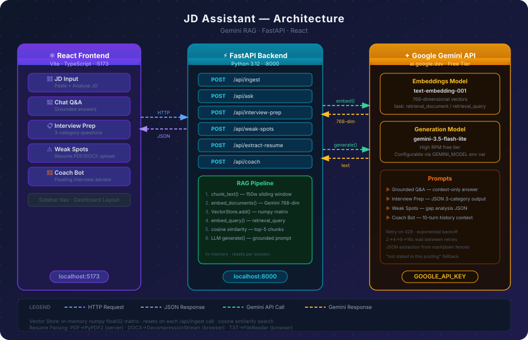

<div align="center">

#  JD Assistant

### AI-powered Job Description Analyser — Grounded Q&A · Interview Prep · Resume Gap Analysis

[](https://python.org)
[](https://fastapi.tiangolo.com)
[](https://react.dev)
[](https://vitejs.dev)
[](https://ai.google.dev)

</div>

---

## Architecture

<div align="center">
  
</div>

### Data Flow

```
User pastes JD
      │
      ▼
POST /api/ingest
      │
      ├─► chunk_text()        — sliding window, 150 words, 30-word overlap
      │
      ├─► embed_documents()   — Gemini text-embedding-001, task=retrieval_document
      │
      └─► VectorStore.add()   — numpy float32 matrix, in-memory

User asks question
      │
      ▼
POST /api/ask
      │
      ├─► embed_query()       — same model, task=retrieval_query
      │
      ├─► VectorStore.search()— cosine similarity, top-5 chunks returned
      │
      └─► Gemini generate()   — grounded prompt → "not stated" fallback

User clicks Interview Prep
      │
      ▼
POST /api/interview-prep
      │
      └─► All JD chunks → Gemini → 3 categories × 4+ questions + rationale

User uploads resume
      │
      ▼
POST /api/extract-resume     — PDF (PyPDF2) / DOCX (python-docx) / TXT
      │
      ▼
POST /api/weak-spots
      │
      └─► JD chunks + resume → Gemini gap analysis → area + reason pairs

Floating coach bot
      │
      ▼
POST /api/coach              — free-form interview advice, 10-turn history
```

---

## Features

| Feature | Description |
|---|---|
| **Grounded Q&A** | Ask anything about the JD — answers cite only JD content, never hallucinate. Says *"not stated in this posting"* when the answer isn't there |
| **Interview Prep** | Generates Technical / Behavioral / Role-specific questions tied to specific JD requirements, each with a one-line rationale |
| **Resume Weak Spots** | Upload your resume (PDF, DOCX, TXT) for a personalised gap analysis against the JD |
| **Interview Coach Bot** | Floating chat bot for general interview advice — STAR method, salary negotiation, system design tips |
| **RAG Pipeline** | Chunk → embed → retrieve → generate. Scales to any JD length without hitting token limits |

---

## Tech Stack

| Layer | Technology |
|---|---|
| Frontend | React 18 + Vite + TypeScript |
| Backend | FastAPI (Python 3.12) |
| Embeddings | Google Gemini `text-embedding-001` (768-dim) |
| Generation | Google Gemini `gemini-3.5-flash-lite` |
| Vector Search | In-memory cosine similarity (numpy) |
| Resume Parsing | PyPDF2 + python-docx (server) · DecompressionStream API (browser, DOCX) |

---

## Local Setup

### Prerequisites

- Python **3.12+**
- Node.js **18+**
- A free [Google AI Studio](https://aistudio.google.com/app/apikey) API key

---

### 1 — Clone the repo

```bash
git clone https://github.com/138AP831/jd-assistant.git
cd jd-assistant
```

---

### 2 — Backend setup

```bash
cd backend

# Create and activate virtual environment
python -m venv venv

# Windows
venv\Scripts\activate

# macOS / Linux
source venv/bin/activate

# Install dependencies
pip install -r requirements.txt
```

Create your `.env` file:

```bash
# Windows
copy .env.example .env

# macOS / Linux
cp .env.example .env
```

Open `backend/.env` and set your API key:

```env
GOOGLE_API_KEY=your_gemini_api_key_here
ALLOWED_ORIGINS=http://localhost:5173
```

Start the backend:

```bash
uvicorn main:app --reload --port 8000
```

Backend running at `http://localhost:8000`
 API docs at `http://localhost:8000/docs`

---

### 3 — Frontend setup

Open a **new terminal**:

```bash
cd frontend
npm install
npm run dev
```

 Frontend running at `http://localhost:5173`

---

### 4 — Use the app

1. Open `http://localhost:5173`
2. Paste a job description → click **Analyse JD**
3. Ask questions in the **Q&A** tab
4. Generate questions in **Interview Prep**
5. Upload your resume in **Weak Spots** for gap analysis
6. Use the **orange bot button** (bottom-right) to chat with the Interview Coach

---

## Project Structure

```
jd-assistant/
├── backend/
│   ├── main.py                  # FastAPI app, CORS, startup
│   ├── requirements.txt
│   ├── .env.example
│   ├── models/
│   │   └── schemas.py           # Pydantic request/response models
│   ├── routers/
│   │   └── jd.py                # All API endpoints
│   └── services/
│       ├── chunker.py           # Sliding-window text chunker
│       ├── embedder.py          # Gemini embedding wrapper
│       ├── vector_store.py      # In-memory cosine similarity store
│       ├── llm.py               # Gemini generation + prompt templates
│       └── resume_parser.py     # PDF / DOCX / TXT text extraction
│
└── frontend/
    ├── src/
    │   ├── api/
    │   │   ├── client.ts        # Typed fetch wrappers
    │   │   └── resumeExtractor.ts # Client-side DOCX/TXT extraction
    │   ├── components/
    │   │   ├── Icons.tsx        # SVG icon library
    │   │   ├── JDInput.tsx      # JD paste + ingest
    │   │   ├── ChatBox.tsx      # Grounded Q&A chat
    │   │   ├── InterviewPrep.tsx# Tabbed interview questions
    │   │   ├── WeakSpots.tsx    # Resume upload + gap analysis
    │   │   └── FloatingBot.tsx  # Interview coach chat widget
    │   ├── App.tsx              # Sidebar layout + routing
    │   └── App.css              # Design system + all styles
    ├── package.json
    └── vite.config.ts
```

---

## API Reference

| Method | Endpoint | Body | Description |
|---|---|---|---|
| `GET` | `/health` | — | Health check |
| `POST` | `/api/ingest` | `{"jd_text": "..."}` | Chunk, embed, and store JD |
| `POST` | `/api/ask` | `{"question": "..."}` | Grounded Q&A |
| `POST` | `/api/interview-prep` | `{}` | Generate interview questions |
| `POST` | `/api/weak-spots` | `{"resume_text": "..."}` | Resume gap analysis |
| `POST` | `/api/extract-resume` | `multipart/form-data file` | Parse resume file → text |
| `POST` | `/api/coach` | `{"message": "...", "history": [...]}` | Interview coach chat |

Full interactive docs available at `http://localhost:8000/docs` (Swagger UI).

---

## Design Decisions

**Why chunk + retrieve instead of full JD in prompt?**
JDs vary from 200 to 2000+ words. Chunking + cosine retrieval scales to any length, keeps context focused on the most relevant passages per query, and avoids token limit issues.

**Why in-memory vector store?**
Zero infrastructure needed. For a demo/assignment scope this is the right tradeoff. Production would use Supabase pgvector or Pinecone for persistence across server restarts.

**Why Gemini embeddings + generation?**
Single API key, single ecosystem. `text-embedding-001` has strong retrieval performance at 768 dimensions. `gemini-3.5-flash-lite` is fast and has a high free-tier RPM limit.

**Grounding enforcement**
The Q&A prompt explicitly instructs the model: *"use ONLY the context provided"* and *"say 'This is not stated in this posting' if the answer isn't there."* This is enforced at the prompt level, not post-processed.


